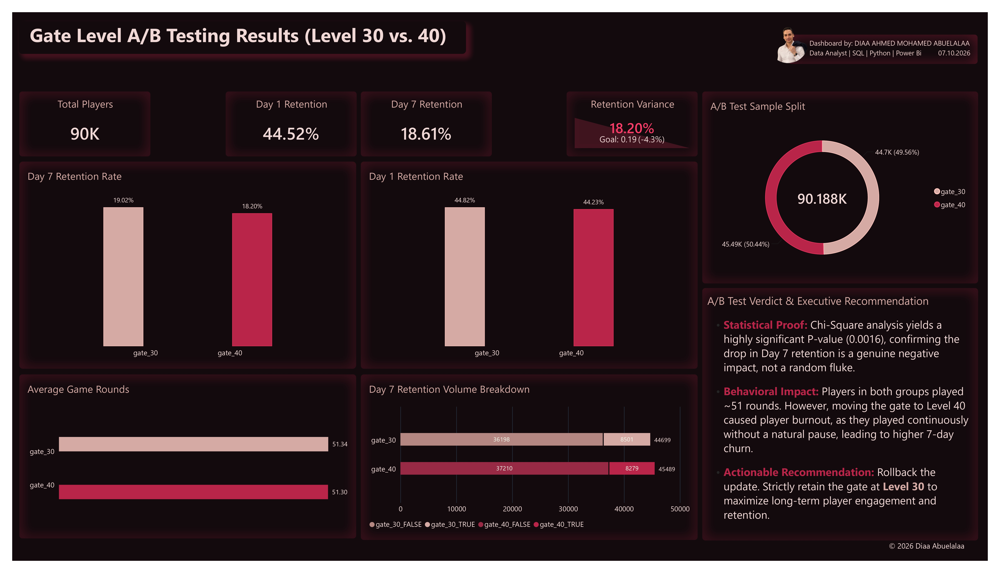
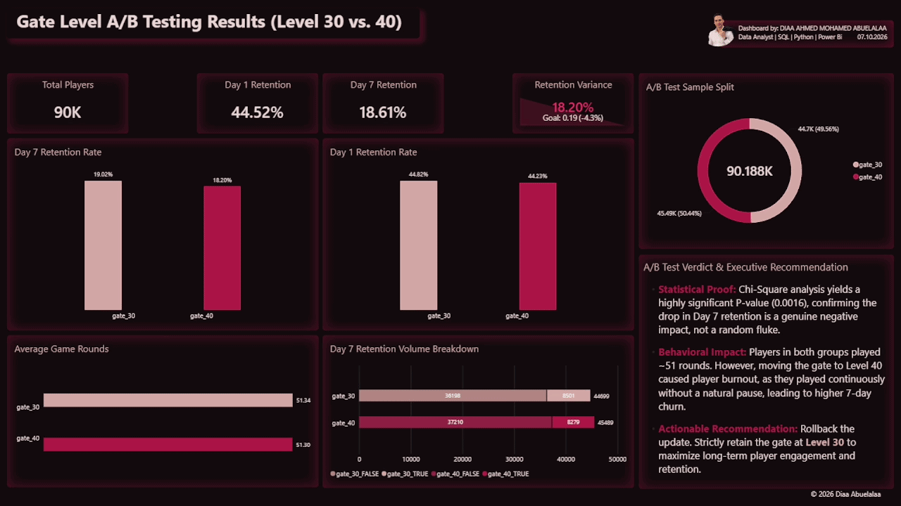

# 🐱 Cookie Cats A/B Testing: Player Retention & Business Impact Analysis


## 📑 1. Executive Summary
This repository contains a comprehensive End-to-End data analysis of an A/B test conducted on the highly popular mobile puzzle game, **Cookie Cats**. The core objective of the experiment was to evaluate the business and user engagement impact of moving the first in-app purchase and forced break "gate" from **Level 30 (Control Group)** to **Level 40 (Test Group)**.

Our rigorous analysis—spanning from SQL Data Engineering to Python Statistical Testing and Power BI Visualization—conclusively proves that delaying the gate to Level 40 has a **statistically significant negative impact on long-term (Day 7) player retention**. To maximize player lifetime value and sustained engagement, we strongly recommend retaining the gate at Level 30.

## 📂 Data Source
The raw dataset used for this analysis was originally sourced from [Kaggle](https://www.kaggle.com/datasets/yufengsui/mobile-games-ab-testing/data?select=cookie_cats.csv). 

*Note: While the raw data originates from Kaggle, the entire end-to-end data pipeline—including SQL data engineering, Python statistical testing, and the Power BI Executive Dashboard—was custom-built from scratch for this specific business use case.*

---

## ⚙️ 2. End-to-End Workflow: Data Engineering, Analysis & Visualization

A standout feature of this project is the robust data pipeline, transitioning seamlessly from raw data ingestion to clean analytical queries, and culminating in an interactive executive dashboard.

### 🛠️️ Step A: SQL Database Design & Exploratory Data Analysis (EDA)
Instead of blindly trusting the dataset, a rigorous Data Quality and Sanity Check process was executed using PostgreSQL:
- **Data Quality & Sanity Checks:** Verified user uniqueness (90,189 unique IDs to ensure no duplicate tracking) and confirmed an even sample split (~50%) between the `gate_30` and `gate_40` test groups.
- **Anomaly Detection:** Analyzed min/max limits of `sum_gamerounds`. Identified 3,994 users who installed but never played a single round (Zero-Round Users), and isolated a massive outlier (49,854 rounds) that required filtering.
- **Baseline KPI Calculation:** Leveraged advanced SQL casting (Boolean-to-Integer) to aggregate initial Day 1 and Day 7 retention rates directly within the database engine before connecting to Python.

*Code Snippet: Advanced SQL Aggregation for Baseline KPIs*
```sql
SELECT
    version_a_b,
    ROUND(AVG(retention_1::INT)*100, 2) AS retention_1_rates,
    ROUND(AVG(retention_7::INT)*100, 2) AS retention_7_rates
FROM public.cookie_cats
GROUP BY version_a_b;
```
*(View the full exploratory data analysis script in the repository: [EDA_Queries.sql](EDA_Queries.sql))*

### 🐍 Step B: Database Integration & Statistical Analysis (Python)
- **Seamless Data Pipeline:** Leveraged `SQLAlchemy` and `Pandas` to establish a direct connection to the PostgreSQL database. Dynamically executed the SQL extraction query to fetch the clean data (filtering out the outlier) directly into a DataFrame.
- **Contingency Tables & Chi-Square Test:** Utilized `pd.crosstab` and `scipy.stats.chi2_contingency` to evaluate retention rates. While Day 1 differences were negligible, Day 7 yielded a highly significant **P-value of 0.0016**, mathematically proving the retention drop.
- **Bootstrapping Simulation:** Programmed a custom simulation (500 resampling iterations) to calculate the relative percentage difference in retention between the two gates, proving the stability of the negative impact.
- **Data Export for BI:** Exported the finalized, robust dataset (`cookie_cats_cleaned.csv`) to serve as the pristine data model for Power BI.

### 📊 Step C: Data Visualization & UI/UX Design (Power BI)
- **Advanced DAX Metrics:** Developed custom, dynamic DAX measures (e.g., `Retention Variance` using `CALCULATE` and `VAR` variables) to ensure precise calculations and avoid implicit metric errors.
- **Executive UI/UX:** Designed a minimalist, dark-themed 'Soft Gaming Pastel' dashboard interface. Applied modern UI/UX principles (high Data-to-Ink ratio, strategic negative space) to minimize cognitive load and highlight actionable insights directly to C-level executives.

---

## 🧮 3. Statistical Rigor: Chi-Square & Bootstrapping

To determine if the observed drop in Day 7 retention was a genuine product of the updated game mechanics rather than random noise, we applied rigorous statistical testing:

- **Null Hypothesis ($H_0$):** Moving the gate to Level 40 has *no impact* on Day 7 retention.
- **Alternative Hypothesis ($H_1$):** Moving the gate to Level 40 *significantly decreases* Day 7 retention.

> **💡 Statistical Verdict (Chi-Square):**
> The Python-driven Chi-Square analysis yielded a highly significant **P-value of 0.0016**. Because this value is far below the standard business alpha threshold of 0.05, we **reject the null hypothesis**. The drop in Day 7 retention (from 19.02% to 18.20%) is a direct, confirmed consequence of the Level 40 gate update.

**Bootstrapping Validation:** A subsequent Bootstrapping simulation (500 resampling iterations) consistently showed a positive percentage difference in favor of the Control group (Gate 30), solidifying the reliability of the initial findings.

---

## 🧠 4. Behavioral Insights: The Burnout Hypothesis

1. **Equal Effort, Different Outcomes:** The dataset revealed that the average game rounds played were nearly identical for both groups (**~51.3 rounds**). This indicates that the *effort* and initial enthusiasm put in by players did not drop.
2. **The Day 7 Churn Explanation:** Why did Day 7 retention drop if players played the same amount? The core issue lies in pacing. At Level 30, players hit a natural, forced break earlier in their initial lifecycle. This brief pause acts as a healthy "pause button," preserving their enthusiasm and prompting them to return days later. By pushing the gate to Level 40, players engaged in an uninterrupted, prolonged session, leading to **Player Burnout**. They binged the game, exhausted themselves, and ultimately churned by Day 7.

---

## 📊 5. Executive Dashboard (Power BI)

Below is the Power BI dashboard built to present these findings to C-level executives. 

### 🖼️ Static Overview
*(A high-resolution snapshot of the final executive layout)*
 

### 🎬 Interactive Demo
*(A demonstration of cross-filtering, dynamic DAX measures, and dashboard interactivity)*
 

---

## 🚀 6. Strategic Recommendations & Next Steps

Based on the robust statistical evidence and behavioral metrics, we present the following strategic directives:

1. **Rollback the Update:** Immediately abandon the Level 40 gate initiative. The definitive drop in Day 7 retention translates to a measurable 4.3% relative loss in long-term returning players, impacting overall revenue.
2. **Strictly Retain Gate at Level 30:** The Level 30 gate currently acts as an optimal psychological pacing mechanism. It forces a healthy break before player fatigue sets in, maximizing long-term engagement.
3. **Future Testing:** Future A/B tests should focus on introducing softer monetization mechanics rather than altering the core friction point of the Level 30 progression gate.

---

## 🤖 7. AI-Assisted Workflow & Knowledge Retrieval
Transparency and modern engineering efficiency were key pillars of this project's execution:
* **Technical Copilot:** Generative AI tools (LLMs) were leveraged as an interactive technical library and debugging copilot for complex DAX logic troubleshooting and syntax optimization.
* **Executive Report Drafting:** AI assistance was utilized to co-structure and refine the written business findings, translating analytical metrics into standard enterprise-level executive phrasing.

---

## 👨‍💻 Developer & Contact
* **Developed By:** DIAA AHMED MOHAMED ABUELALAA *(Data Analyst | SQL | Python | Power BI)*
* **GitHub Profile:** [Eng-Diaa](https://github.com/Eng-Diaa)
* **Kaggle Profile:** [diaa96](https://www.kaggle.com/diaa96/code)
* **LinkedIn:** [Diaa Abuelalaa](https://www.linkedin.com/in/diaa-abuelalaa-data-analyst/)
